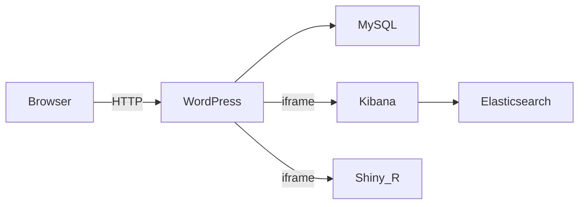

# DSN-DASH — Premissas técnicas e mapa de riscos

| Campo | Valor |
|-------|-------|
| Projeto | DSN-DASH |
| Fase | Descoberta |
| Relacionado | [briefing.md](./briefing.md), [requisitos-nao-funcionais.md](./requisitos-nao-funcionais.md) |
| Data | 2026-09-20 |

**Convenção:** cada item é marcado como **FATO**, **HIPÓTESE** ou **RESTRIÇÃO CONFIRMADA**.  
Nesta fase, “premissa validada” = **viabilidade documentada com controles conhecidos**, não compose green / smoke test executado.

---

## 1. Separação: fatos vs hipóteses

### 1.1 Fatos

| ID | Afirmação |
|----|-----------|
| F-01 | O repositório está greenfield (sem código de aplicação, Docker ou docs prévios além desta discovery). |
| F-02 | Embutir Kibana em iframe cross-origin exige que o Kibana (e qualquer proxy à frente) **não** bloqueiem framing: `server.securityResponseHeaders.disableEmbedding` não pode forçar bloqueio; `csp.frame_ancestors` deve incluir a origem do WordPress. |
| F-03 | Quando `disableEmbedding` está ativo, o Kibana aplica CSP `frame-ancestors: 'self'` e `X-Frame-Options: SAMEORIGIN`, impedindo embed em outro host. |
| F-04 | Proxies (ex.: nginx) podem **reintroduzir** `X-Frame-Options: SAMEORIGIN` mesmo com Kibana configurado corretamente — causa clássica de falha de iframe. |
| F-05 | CORS **não** impede a *renderização* de um documento em `<iframe>`; CORS regula requisições cross-origin iniciadas por scripts (XHR/fetch). |
| F-06 | Shiny / ShinyProxy embutidos cross-origin exigem headers de frame permissivos (`frame-ancestors` / frame-options adequados); em cenários cross-site, cookies `SameSite=None` + `Secure` e frequentemente HTTPS. |
| F-07 | WordPress no admin envia headers anti-framing; páginas públicas dependem de tema/plugins de segurança para CSP `frame-src` / políticas restritivas. |

### 1.2 Hipóteses

| ID | Afirmação |
|----|-----------|
| H-01 | WordPress será o shell de UI das duas páginas e do carrossel. |
| H-02 | Kibana e Shiny serão consumidos via iframe a partir do WP. |
| H-03 | Docker Compose local reunirá WP + MySQL + Elasticsearch + Kibana + Shiny. |
| H-04 | Seed fictício (índices ES + datasets R) será suficiente para demos e validação de UX. |
| H-05 | Homogeneidade visual é alcançável via CSS do tema WP + theming Shiny + parâmetros de embed Kibana. |
| H-06 | Em desenvolvimento local, HTTP same-LAN / hosts mapeados bastam; produção usará HTTPS. |
| H-07 | O browser do usuário final não chamará a API do Elasticsearch diretamente (somente via Kibana embutido). |

### 1.3 Restrições confirmadas (produto)

| ID | Afirmação |
|----|-----------|
| R-01 | Sem scroll vertical na página-host → carrossel lateral. |
| R-02 | Apenas duas páginas principais: Por Tema e Por Plataforma. |
| R-03 | Sem dados reais na discovery/demo. |
| R-04 | Análises simples; sem ML nem estatística complexa. |
| R-05 | Taxonomias Tema/Plataforma permanecem abertas até a Etapa 1. |
| R-06 | Não pin de versões finais de bibliotecas nesta fase. |

---

## 2. Registro de premissas técnicas

| ID | Tipo | Premissa | Validação nesta fase | Status |
|----|------|----------|----------------------|--------|
| P-ENV | Hipótese | Ambiente local via Docker Compose: WordPress, MySQL, Elasticsearch, Kibana, Shiny (R) | Topologia documentada (§3); smoke test **não** executado | Aberta (smoke) |
| P-IFRAME | Fato + hipótese de config | Kibana e Shiny são embutíveis via iframe **se** headers `frame-ancestors` / XFO e CSP do pai permitirem | Controles conhecidos documentados (§4); config a aplicar na implementação | Viável (documental) |
| P-SEED | Hipótese | Índices e datasets fictícios bastam para demos | Aceita até haver requisitos de volume/forma na Etapa 1 | Aberta |
| P-UX | Restrição confirmada | Viewport único; carrossel lateral; 2 rotas | Confirmado pelo produto | Confirmada |
| P-HOMOG | Hipótese | Aparência homogênea via tema WP + theming / opções de embed | Risco médio (§5); prova visual na prototipagem | Aberta |
| P-VER | Delimitação | Versões de WP, Elastic, R/Shiny **não** são escolhidas agora | Apenas viabilidade de integração | Confirmada (não pin) |
| P-CORS | Fato | Integração por iframe isolado evita dependência de CORS para exibir gráficos | Arquitetura recomendada: não usar fetch do browser → ES | Viável (documental) |

---

## 3. Topologia Docker proposta (hipótese)

Não executar nesta etapa. Serve como referência para REQ/ambiente e para o smoke test futuro.

| Serviço | Função candidata | Notas |
|---------|------------------|-------|
| WordPress | Host das páginas Tema/Plataforma e carrossel | Origem pai dos iframes |
| MySQL | Persistência WP | Sem exposição pública |
| Elasticsearch | Dados do seed / consultas Kibana | **Não** expor ao browser |
| Kibana | Dashboards em iframe | Configurar `frame_ancestors` + cuidado com proxy |
| Shiny (R) | Visualizações ggplot2/interativas simples em iframe | Headers de frame + cookies se cross-site |

**Critério de validação futura (fora desta discovery):** `docker compose up` sobe todos os serviços; página WP carrega dois iframes (Kibana + Shiny) sem erro de framing no console.

---

## 4. Restrições iframe / CSP / CORS / X-Frame-Options

### 4.1 Lado filho — Kibana

| Controle | Efeito | Ação candidata |
|----------|--------|----------------|
| `server.securityResponseHeaders.disableEmbedding: true` | Força `frame-ancestors 'self'` + `X-Frame-Options: SAMEORIGIN` | Manter **false** quando embed for necessário |
| `csp.frame_ancestors` | Lista origens autorizadas a embutir o Kibana | Incluir origem do WordPress (ex.: `http://localhost:8080`) |
| Proxy na frente | Pode adicionar XFO SAMEORIGIN | Auditar e remover/ajustar headers duplicados |

### 4.2 Lado filho — Shiny / ShinyProxy

| Controle | Efeito | Ação candidata |
|----------|--------|----------------|
| `X-Frame-Options: DENY` / `SAMEORIGIN` | Bloqueia iframe cross-origin | Remover ou substituir por política explícita |
| CSP `frame-ancestors` | Controle moderno de quem pode embutir | Incluir origem do WP; preferir a `ALLOW-FROM` (obsoleto) |
| Cookies cross-site | Sessão pode falhar no iframe | `SameSite=None; Secure` + HTTPS em produção |
| ShinyProxy | Config específica para iframe multi-domínio | Seguir docs oficiais se essa via for escolhida |

### 4.3 Lado pai — WordPress

| Controle | Efeito | Ação candidata |
|----------|--------|----------------|
| CSP `frame-src` / `child-src` (tema/plugin) | Impede carregar URLs dos embeds | Allowlist das origens Kibana e Shiny |
| Plugins de segurança | Podem endurecer headers sem aviso | Inventariar na implementação |

### 4.4 CORS — esclarecimento

| Cenário | CORS é relevante? |
|---------|-------------------|
| `<iframe src="https://kibana...">` apenas para exibir | **Não** (framing ≠ CORS) |
| JS no tema WP faz `fetch` à API do ES ou Shiny | **Sim** — evitar; preferir iframe isolado |
| Recursos (fontes, XHR) *dentro* do app embutido | Política própria do Kibana/Shiny |

---

## 5. Mapa de riscos (classificação)

| ID | Risco | Severidade | Probabilidade | Notas / mitigação preliminar |
|----|-------|------------|---------------|------------------------------|
| RK-01 | Kibana recusa embed (`frame-ancestors` / `disableEmbedding` / XFO) | **Alto** | Alta sem config | Config Kibana + auditoria de proxy; checklist no compose futuro |
| RK-02 | Shiny recusa embed ou sessão quebra cross-origin (cookies/HTTPS) | **Alto** | Média–alta | Headers `frame-ancestors`; HTTPS em prod; validar SameSite |
| RK-03 | CSP do WordPress (pai) bloqueia `frame-src` | **Médio** | Média | Allowlist no tema/plugin; testar com DevTools |
| RK-04 | Tentativa de integração via fetch → ES gera erros CORS e exposição indevida | **Médio** | Baixa se arquitetura iframe for seguida | **Não** expor ES ao browser; só Kibana |
| RK-05 | Homogeneidade visual Kibana vs ggplot2/Shiny insuficiente | **Médio** | Alta | Guia visual na Etapa 1/2; reduzir chrome Kibana; tokens CSS no WP |
| RK-06 | Carrossel + “sem scroll” vs altura/overflow interno dos iframes | **Médio** | Alta | Altura fixa por viewport; hidescroll no host; aceitar scroll *interno* do embed ou redesenhar painéis |
| RK-07 | Auth Kibana incompatível com painel público | **Baixo** | Média em prod | Demo local sem auth; decisão de auth pública na Etapa 1 |
| RK-08 | Stack Docker completa consome muita RAM/CPU local | **Baixo** | Média | Perfis compose (minimal vs full); docs de requisitos de máquina |

---

## 6. Compatibilidade WordPress + iframe (síntese de viabilidade)

| Pergunta | Resposta nesta discovery |
|----------|--------------------------|
| WP pode hospedar iframes de Kibana/Shiny? | **Sim**, como qualquer página HTML, desde que o **filho** permita framing e o **pai** permita `frame-src`. |
| Há bloqueio inerente do core WP em páginas públicas? | **Não** por padrão para conteúdo público; plugins/temas podem introduzir CSP. |
| CORS impede o embed? | **Não** para display via iframe. |
| Versões específicas já validadas em runtime? | **Não** — deliberadamente fora de escopo; smoke test aberto. |

**Veredito documental:** a arquitetura WP + iframe Kibana + iframe Shiny é **viável**, condicionada à configuração explícita de headers e à disciplina de não expor Elasticsearch ao browser.

---

## 7. Premissas abertas (checklist operacional)

- [ ] Smoke test Docker Compose da topologia §3
- [ ] Pin de versões (WP, Elastic Stack, R/Shiny, imagens)
- [ ] Origens canônicas (URLs locais/produção) para `frame_ancestors` e `frame-src`
- [ ] Decisão Shiny Server vs ShinyProxy vs container mínimo
- [ ] Same-origin via reverse proxy vs multi-origem explícito
- [ ] Política de auth dos dashboards Kibana embutidos
- [ ] Taxonomias Tema/Plataforma (produto — Etapa 1)

---

## 8. Próximo passo

Na **Etapa 1 — Especificação de Requisitos**, converter riscos Alto/Médio em critérios de aceite (REQ/RNF) e definir o experimento mínimo de framing (checklist de headers) antes da implementação.
