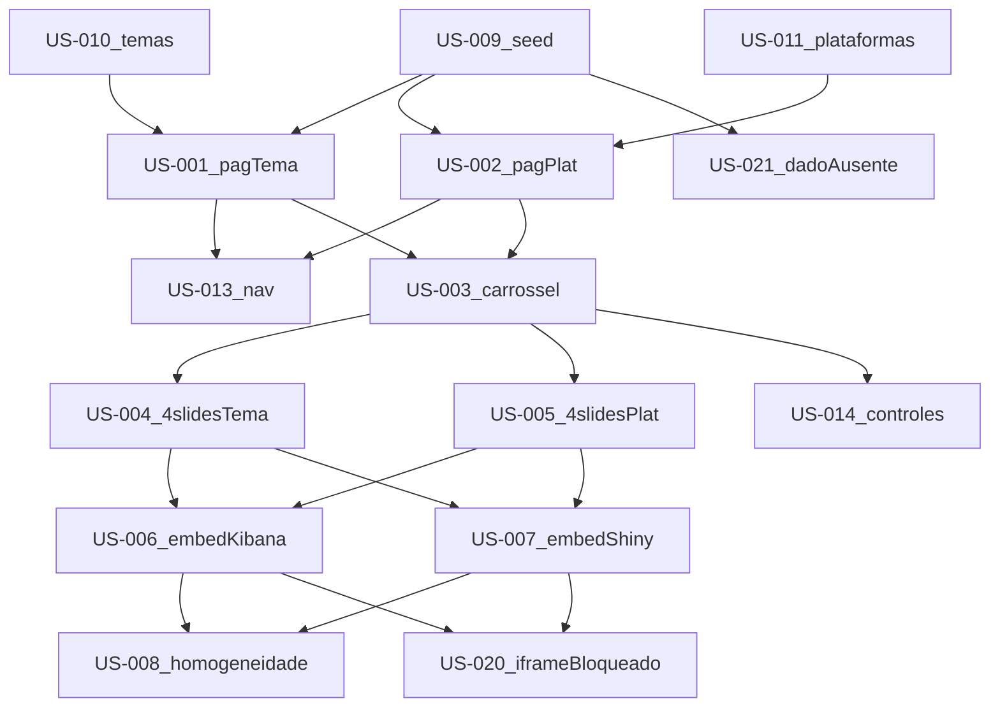

# DSN-DASH — Backlog de User Stories (INVEST)

| Campo | Valor |
|-------|-------|
| Projeto | DSN-DASH |
| Fase MEGA | Especificação detalhada |
| Origem | [RF/RNF Etapa 1](../01-requirements/requisitos-funcionais.md) |
| Destino | TASK-*, TEST-* |
| Data | 2026-09-20 |

---

## Personas

| ID | Persona | Motivação |
|----|---------|-----------|
| P1 | Analista de desinformação | Explorar propagação por tema e plataforma com gráficos claros |
| P2 | Cliente / demonstração | Ver o painel em demo rápida, linguagem simples, dados fictícios explícitos |
| P3 | Admin WP | Garantir seed reprodutível, framing correto e ES não exposto |

---

## Dependências entre US



| US | Depends-on |
|----|------------|
| US-001 | US-009, US-010 |
| US-002 | US-009, US-011 |
| US-003 | US-001 ou US-002 |
| US-004 | US-003 |
| US-005 | US-003 |
| US-006 | US-004, US-005 |
| US-007 | US-004, US-005 |
| US-008 | US-006, US-007 |
| US-009 | nenhuma |
| US-010 | nenhuma |
| US-011 | nenhuma |
| US-012 | US-001, US-002 |
| US-013 | US-001, US-002 |
| US-014 | US-003 |
| US-015 | US-004, US-005 |
| US-016 | US-004, US-005 |
| US-017 | US-009 |
| US-018 | US-001, US-002 |
| US-019 | nenhuma (adiada) |
| US-020 | US-006, US-007 |
| US-021 | US-009 |

---

## Catálogo de histórias

### US-001 — Página Por Tema

- **Como** Analista de desinformação, **quero** acessar uma página dedicada “Por Tema”, **para** explorar a propagação organizada por tema.
- **RF:** RF-001 (; RNF-012)
- **Prioridade:** Must
- **Depends-on:** US-009, US-010
- **Destino:** TASK-001, TEST-001
- **INVEST:** Independente o bastante após seed/catálogo; negociável no layout; valiosa; estimável; small; testável.
- **Aceite (Gherkin):**

```gherkin
Scenario: Acessar página Por Tema
  Given que o painel DSN-DASH está disponível
  When eu acesso a entrada "Por Tema"
  Then eu vejo o conteúdo exclusivo dessa página
  And o conteúdo é distinto da página "Por Plataforma"

Scenario: Rota principal limitada
  Given que estou no painel
  When eu inventário as rotas principais de análise
  Then existem exatamente 2 rotas principais
```

---

### US-002 — Página Por Plataforma

- **Como** Analista de desinformação, **quero** acessar uma página dedicada “Por Plataforma”, **para** comparar a propagação entre canais.
- **RF:** RF-002 (; RNF-012)
- **Prioridade:** Must
- **Depends-on:** US-009, US-011
- **Destino:** TASK-002, TEST-002
- **INVEST:** ok (espelha US-001).
- **Aceite (Gherkin):**

```gherkin
Scenario: Acessar página Por Plataforma
  Given que o painel DSN-DASH está disponível
  When eu acesso a entrada "Por Plataforma"
  Then eu vejo o conteúdo exclusivo dessa página
  And o conteúdo é distinto da página "Por Tema"
```

---

### US-003 — Carrossel sem scroll no host

- **Como** Cliente em demonstração, **quero** navegar o conteúdo por carrossel lateral sem scroll vertical na página, **para** manter a visão em um único viewport.
- **RF:** RF-003 (; RNF-001, RNF-002)
- **Prioridade:** Must
- **Depends-on:** US-001 ou US-002
- **Destino:** TASK-003, TEST-003
- **INVEST:** ok.
- **Aceite (Gherkin):**

```gherkin
Scenario: Navegação lateral sem scroll vertical
  Given que estou em uma página principal do painel
  And o viewport é 1366x768 ou 1920x1080
  When eu navego o conteúdo da página
  Then não há scroll vertical na página-host
  And a troca de conteúdo ocorre pelo carrossel lateral

Scenario: Performance da troca de slide no host
  Given que o carrossel está visível
  When eu avanço para o próximo slide
  Then a transição do host completa em menos de 300 ms
```

---

### US-004 — Quatro slides Por Tema

- **Como** Analista de desinformação, **quero** percorrer exatamente 4 slides na página Por Tema, **para** ver o conjunto completo de visualizações desse eixo.
- **RF:** RF-004
- **Prioridade:** Must
- **Depends-on:** US-003
- **Destino:** TASK-004, TEST-004
- **INVEST:** ok.
- **Aceite (Gherkin):**

```gherkin
Scenario: Quatro slides na página Por Tema
  Given que estou na página "Por Tema"
  When eu percorro o carrossel até o fim
  Then existem exatamente 4 slides
  And cada slide exibe ao menos um gráfico
```

---

### US-005 — Quatro slides Por Plataforma

- **Como** Analista de desinformação, **quero** percorrer exatamente 4 slides na página Por Plataforma, **para** ver o conjunto completo de visualizações desse eixo.
- **RF:** RF-005
- **Prioridade:** Must
- **Depends-on:** US-003
- **Destino:** TASK-005, TEST-005
- **INVEST:** ok.
- **Aceite (Gherkin):**

```gherkin
Scenario: Quatro slides na página Por Plataforma
  Given que estou na página "Por Plataforma"
  When eu percorro o carrossel até o fim
  Then existem exatamente 4 slides
  And cada slide exibe ao menos um gráfico
```

---

### US-006 — Embed Elasticsearch/Kibana

- **Como** Analista de desinformação, **quero** ver visualizações Kibana embutidas no painel, **para** analisar agregações descritivas sem sair do DSN-DASH.
- **RF:** RF-006 (; RNF-003, RNF-004, RNF-007, RNF-009)
- **Prioridade:** Must
- **Depends-on:** US-004, US-005
- **Destino:** TASK-006, TEST-006
- **INVEST:** ok.
- **Aceite (Gherkin):**

```gherkin
Scenario: Embed Kibana visível por página
  Given que estou em cada página principal
  When eu navego os slides
  Then ao menos um slide exibe visualização originada de Elasticsearch/Kibana
  And o iframe possui title não vazio
  And não há erro de framing no console

Scenario: Primeiro embed útil no slide inicial
  Given ambiente local de demo
  When a página carrega no slide inicial com embed
  Then o conteúdo do iframe fica visível em menos de 5 s

Scenario: ES não acessível pelo browser
  Given que o painel está em uso
  When o browser tenta acessar a API do Elasticsearch diretamente
  Then a conexão falha ou é recusada
```

---

### US-007 — Embed R/Shiny

- **Como** Analista de desinformação, **quero** ver visualizações Shiny/ggplot2 embutidas, **para** complementar a leitura com gráficos da origem R.
- **RF:** RF-007 (; RNF-003, RNF-004, RNF-007)
- **Prioridade:** Must
- **Depends-on:** US-004, US-005
- **Destino:** TASK-007, TEST-007
- **INVEST:** ok.
- **Aceite (Gherkin):**

```gherkin
Scenario: Embed Shiny visível por página
  Given que estou em cada página principal
  When eu navego os slides
  Then ao menos um slide exibe visualização originada de R/Shiny
  And o iframe possui title não vazio
  And não há erro de framing no console
```

---

### US-008 — Homogeneidade visual

- **Como** Cliente em demonstração, **quero** que gráficos Kibana e Shiny pareçam do mesmo produto, **para** não perceber ruptura visual na demo.
- **RF:** RF-008 (; RNF-005)
- **Prioridade:** Must
- **Depends-on:** US-006, US-007
- **Destino:** TASK-008, TEST-008
- **INVEST:** ok.
- **Aceite (Gherkin):**

```gherkin
Scenario: Checklist de homogeneidade
  Given um embed Kibana e um embed Shiny na mesma página
  When comparo aparência e enquadramento
  Then compartilham paleta com pelo menos 4 tokens de cor
  And usam a mesma família tipográfica do shell
  And a diferença de padding externo dos iframes é no máximo 8 px
```

---

### US-009 — Seed fictício dimensional

- **Como** Admin WP, **quero** carregar um seed fictício com todas as dimensões do domínio, **para** alimentar demos sem dados reais.
- **RF:** RF-009 (; RNF-010)
- **Prioridade:** Must
- **Depends-on:** nenhuma
- **Destino:** TASK-009, TEST-009
- **INVEST:** ok.
- **Aceite (Gherkin):**

```gherkin
Scenario: Seed cobre o domínio
  Given que o seed foi carregado
  When inspeciono as dimensões disponíveis
  Then há cobertura das 4 plataformas
  And dos 15 temas
  And das 27 UFs
  And dos anos 2021, 2022, 2023 e 2024
  And não há PII real
```

---

### US-010 — Catálogo de 15 temas

- **Como** Analista de desinformação, **quero** que o painel use o catálogo fixo de 15 temas, **para** padronizar a exploração.
- **RF:** RF-010
- **Prioridade:** Must
- **Depends-on:** nenhuma
- **Destino:** TASK-010, TEST-010
- **INVEST:** ok.
- **Aceite (Gherkin):**

```gherkin
Scenario: Catálogo de temas
  Given o painel ou seed disponível
  When listo os temas do eixo principal
  Then a lista contém exatamente: eleição, governo, vacinas, saúde, educação, economia, segurança, meio_ambiente, religião, gênero, imigração, ciência, mídia, justiça, outros
```

---

### US-011 — Catálogo de 4 plataformas

- **Como** Analista de desinformação, **quero** que o painel use o catálogo fixo de 4 plataformas, **para** padronizar comparações.
- **RF:** RF-011
- **Prioridade:** Must
- **Depends-on:** nenhuma
- **Destino:** TASK-011, TEST-011
- **INVEST:** ok.
- **Aceite (Gherkin):**

```gherkin
Scenario: Catálogo de plataformas
  Given o painel ou seed disponível
  When listo as plataformas do eixo principal
  Then a lista contém exatamente: WhatsApp, Facebook, Instagram, YouTube
```

---

### US-012 — Análises apenas descritivas

- **Como** Cliente em demonstração, **quero** ver apenas análises simples, **para** compreender os dados sem jargão estatístico avançado.
- **RF:** RF-012
- **Prioridade:** Must
- **Depends-on:** US-001, US-002
- **Destino:** TASK-012, TEST-012
- **INVEST:** ok.
- **Aceite (Gherkin):**

```gherkin
Scenario: Escopo analítico descritivo
  Given o conjunto de slides e textos do painel
  When reviso as capacidades analíticas oferecidas
  Then não há funcionalidade de ML, previsão ou estatística complexa
  And há apenas descrições e agregações simples
```

---

### US-013 — Navegação entre páginas

- **Como** Analista de desinformação, **quero** alternar entre Por Tema e Por Plataforma pela interface, **para** comparar eixos sem digitar URL.
- **RF:** RF-013
- **Prioridade:** Must
- **Depends-on:** US-001, US-002
- **Destino:** TASK-013, TEST-013
- **INVEST:** ok.
- **Aceite (Gherkin):**

```gherkin
Scenario: Alternar páginas via navegação
  Given que estou em uma das duas páginas principais
  When aciono o controle de navegação para a outra página
  Then a página correspondente é apresentada
```

---

### US-014 — Controles e indicador do carrossel

- **Como** Analista de desinformação, **quero** avançar, voltar e ver a posição do slide, **para** saber onde estou no percurso.
- **RF:** RF-014 (; RNF-006)
- **Prioridade:** Must
- **Depends-on:** US-003
- **Destino:** TASK-014, TEST-014
- **INVEST:** ok.
- **Aceite (Gherkin):**

```gherkin
Scenario: Controles e indicador
  Given um carrossel com 4 slides
  When eu avanço e volto entre slides
  Then a posição muda corretamente
  And o indicador reflete o índice atual

Scenario: Operação por teclado
  Given o carrossel visível
  When uso apenas teclado Tab, Enter/Espaço ou setas
  Then 100% dos controles de avançar/voltar são operáveis
  And o foco é visível
```

---

### US-015 — Conteúdo alinhado ao eixo

- **Como** Analista de desinformação, **quero** que cada slide enfatize o eixo da página (tema ou plataforma), **para** não misturar a leitura.
- **RF:** RF-015
- **Prioridade:** Should
- **Depends-on:** US-004, US-005
- **Destino:** TASK-015, TEST-015
- **INVEST:** ok.
- **Aceite (Gherkin):**

```gherkin
Scenario: Eixo dominante por página
  Given cada slide das páginas principais
  When leio título, legenda e recorte do gráfico
  Then o eixo dominante corresponde à página atual
```

---

### US-016 — Legendas curtas

- **Como** Cliente em demonstração, **quero** ler um texto curto em cada slide, **para** entender o gráfico sem conhecimento técnico avançado.
- **RF:** RF-016 (; RNF-008)
- **Prioridade:** Should
- **Depends-on:** US-004, US-005
- **Destino:** TASK-016, TEST-016
- **INVEST:** ok.
- **Aceite (Gherkin):**

```gherkin
Scenario: Legenda em cada slide
  Given os 8 slides do painel
  When um slide está ativo
  Then há texto de apoio curto em linguagem acessível
  And o contraste do texto do shell atende WCAG 2.1 AA para corpo (>= 4.5:1)
```

---

### US-017 — Seed reprodutível

- **Como** Admin WP, **quero** reaplicar um seed versionado, **para** recriar a demo de forma determinística.
- **RF:** RF-017
- **Prioridade:** Should
- **Depends-on:** US-009
- **Destino:** TASK-017, TEST-017
- **INVEST:** ok.
- **Aceite (Gherkin):**

```gherkin
Scenario: Reaplicar seed
  Given o artefato ou procedimento de seed versionado
  When executo o procedimento de carga
  Then as dimensões do domínio ficam disponíveis novamente
```

---

### US-018 — Indicação de dados fictícios

- **Como** Cliente em demonstração, **quero** ver que os dados são fictícios, **para** não confundir a demo com produção.
- **RF:** RF-018
- **Prioridade:** Could
- **Depends-on:** US-001, US-002
- **Destino:** TASK-018, TEST-018
- **INVEST:** ok.
- **Aceite (Gherkin):**

```gherkin
Scenario: Aviso de dados fictícios
  Given qualquer das duas páginas principais
  When a página é carregada
  Then há indicação visível de que os dados são fictícios
```

---

### US-019 — Auth de embeds em produção (adiada)

- **Como** Admin WP, **quero** uma política de autenticação dos embeds em produção, **para** controlar acesso — **fora do incremento atual**.
- **RF:** RF-019
- **Prioridade:** Won't
- **Depends-on:** nenhuma
- **Destino:** TASK-019, TEST-019
- **INVEST:** registrada; não implementável neste incremento.
- **Aceite (Gherkin):**

```gherkin
Scenario: Fora do incremento atual
  Given o escopo do incremento atual do DSN-DASH
  When avalio autenticação de embeds em produção
  Then o requisito permanece adiado
  And a demo local pode operar sem autenticação de embeds
```

---

### US-020 — Exceção: iframe bloqueado

- **Como** Cliente em demonstração, **quero** uma mensagem clara quando o embed for bloqueado, **para** entender a falha sem quebrar o layout do painel.
- **RF:** RF-006, RF-007 (; RNF-004, RNF-011)
- **Prioridade:** Must
- **Depends-on:** US-006, US-007
- **Destino:** TASK-020, TEST-020
- **INVEST:** ok (fatia de exceção).
- **Aceite (Gherkin):**

```gherkin
Scenario: Iframe bloqueado por framing
  Given um serviço embutido que recusa framing
  When o slide com esse embed é exibido
  Then o host mostra mensagem compreensível de indisponibilidade
  And a página-host mantém layout sem scroll vertical indesejado
  And o Elasticsearch não é exposto como alternativa no browser

Scenario: Framing com allowlist em configuração correta
  Given serviços configurados com frame-ancestors explícitos
  When carrego embeds Kibana e Shiny
  Then não há uso de "*" em frame-ancestors no ambiente alinhado a produção
  And não há erro de framing no console
```

---

### US-021 — Exceção: dado ou visualização ausente

- **Como** Analista de desinformação, **quero** feedback quando um slide não tiver dado/visualização, **para** saber que a ausência é tratada e não um “branco silencioso”.
- **RF:** RF-009, RF-004, RF-005
- **Prioridade:** Must
- **Depends-on:** US-009
- **Destino:** TASK-021, TEST-021
- **INVEST:** ok.
- **Aceite (Gherkin):**

```gherkin
Scenario: Dado ou gráfico ausente no slide
  Given um slide cuja visualização ou dado esperado está ausente
  When o slide torna-se ativo
  Then o host exibe estado/mensagem de dado indisponível
  And o carrossel permanece navegável
  And o layout do host não introduz scroll vertical
```

---

## Cobertura RF → US (100%)

| RF | US primária | US adicionais |
|----|-------------|---------------|
| RF-001 | US-001 | — |
| RF-002 | US-002 | — |
| RF-003 | US-003 | — |
| RF-004 | US-004 | US-021 |
| RF-005 | US-005 | US-021 |
| RF-006 | US-006 | US-020 |
| RF-007 | US-007 | US-020 |
| RF-008 | US-008 | — |
| RF-009 | US-009 | US-021 |
| RF-010 | US-010 | — |
| RF-011 | US-011 | — |
| RF-012 | US-012 | — |
| RF-013 | US-013 | — |
| RF-014 | US-014 | — |
| RF-015 | US-015 | — |
| RF-016 | US-016 | — |
| RF-017 | US-017 | — |
| RF-018 | US-018 | — |
| RF-019 | US-019 | — |

**Resultado:** 19/19 RF cobertos por ≥1 US.

## Referência de qualidade RNF → US (sem US duplicadas)

| RNF | Incorporado em |
|-----|----------------|
| RNF-001, RNF-002 | US-003 |
| RNF-003, RNF-004, RNF-007, RNF-009 | US-006, US-007, US-020 |
| RNF-005 | US-008 |
| RNF-006 | US-014 |
| RNF-008 | US-016 |
| RNF-010 | US-009 |
| RNF-011 | US-020 |
| RNF-012 | US-001, US-002 |
| Matriz US-101..112 | aliases de qualidade → TEST-101..112 na fase de testes |

---

## Gaps

- Auth de embeds em produção (US-019 / RF-019 Won't)
- Pin de versões de stack
- Smoke test Docker Compose
- Detalhamento de TASK/TEST (próxima fase)

## Critérios de conclusão

- [x] 100% dos RF cobertos por ≥1 US
- [x] Critérios em Gherkin para cada US-001..021
- [x] Dependências mapeadas

## Próximo passo

Quebra em **TASK-*** e plano **TEST-*** (incl. TEST-020/021 para exceções). Ver também [casos-de-uso.md](./casos-de-uso.md).
