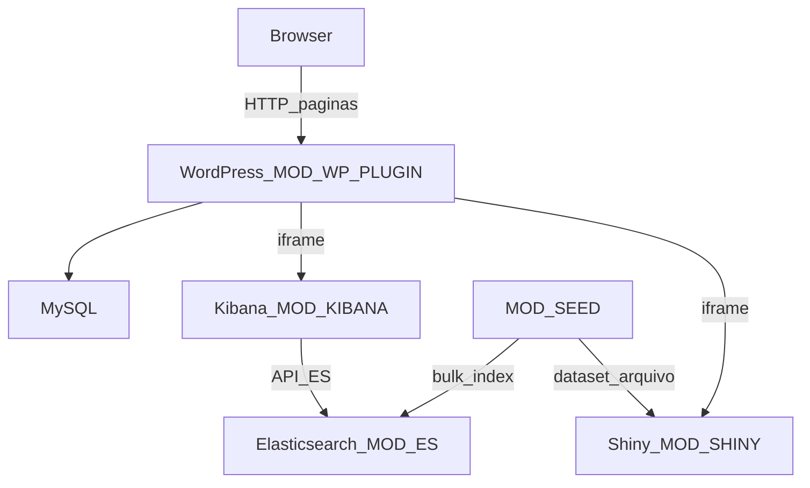

# DSN-DASH — C4 Container (nível 2)

| Campo | Valor |
|-------|-------|
| Projeto | DSN-DASH |
| Fase MEGA | Arquitetura |
| Relacionado | [c4-context.md](./c4-context.md), [adr/](./adr/) |
| Data | 2026-09-20 |

---

## Diagrama de containers



**MVP Shiny:** lê dataset montado em volume (CSV/RDS fictício), **não** consulta ES diretamente. Kibana é a UI sobre `API-ES`.

---

## Catálogo de containers / módulos

| ID | Container / módulo | Responsabilidade | Portas lógicas (rascunho) |
|----|--------------------|------------------|---------------------------|
| MOD-WP-PLUGIN | WordPress + plugin `dsn-dashboard` | Páginas Tema/Plataforma, shortcode, shell carrossel, wrapper CSS | 8080 → browser |
| MOD-CAROUSEL | Front no plugin (Swiper.js) | 4 slides/página, teclado, estados loading/error/empty | — (assets WP) |
| MOD-KIBANA | Kibana 8.x | Dashboards embutidos | 5601 (rede Docker; iframe) |
| MOD-ES | Elasticsearch 8.x | Índice `desinfo_events` | 9200 **somente rede interna** |
| MOD-SHINY | R Shiny | Visualizações ggplot2/simples em iframe | 3838 (rede Docker; iframe) |
| MOD-SEED | Job/artefato de seed | Carga ES + dataset Shiny | — |
| — | MySQL | Persistência WP | 3306 interna |

### APIs

| ID | De → Para | Público? |
|----|-----------|----------|
| API-ES | Kibana → Elasticsearch | Não (rede Docker) |
| API-SEED | Operador/P3 → ES (+ arquivos Shiny) | Operacional, não browser |

---

## Contrato do shortcode (MOD-WP-PLUGIN) — antes de codar

### Sintaxe

```
[dsn_dashboard page="tema"|"plataforma" slide="1-4" height="css"]
```

| Atributo | Obrigatório | Valores | Default |
|----------|-------------|---------|---------|
| `page` | Sim | `tema` \| `plataforma` | — |
| `slide` | Não | `1`..`4` | `1` (slide inicial) |
| `height` | Não | CSS length (ex. `70vh`) | definido pelo tema do plugin |

### Saída HTML esperada (contrato)

- Root: `.dsn-dashboard` com `data-page="{tema|plataforma}"`
- Nav do produto (duas rotas) fica na página WP / template; o shortcode foca no **carrossel da página**
- Carrossel Swiper: `.dsn-swiper` com **4** `.swiper-slide`
- Cada slide:
  - `data-slide-index="1..4"`
  - `data-embed-type="kibana"|"shiny"`
  - `data-state="loading"|"ready"|"error"|"empty"`
  - Legenda `.dsn-slide-caption`
  - Wrapper `.dsn-embed-frame` contendo `<iframe title="...">` **ou** placeholder de estado
- Controles: prev/next + paginação (indicador “n de 4”)
- Badge opcional de dados fictícios: `.dsn-badge-fake` (US-018)

### Páginas WP

Exatamente **duas** páginas principais (RNF-012):

1. Por Tema → shortcode `[dsn_dashboard page="tema"]`
2. Por Plataforma → shortcode `[dsn_dashboard page="plataforma"]`

Detalhe visual/estados: [design-carrossel.md](./design-carrossel.md).

---

## Mapa RNF → decisão arquitetural

| RNF | Decisão / artefato |
|-----|-------------------|
| RNF-001 | [ADR-003](./adr/ADR-003-swiper.md) + design-carrossel |
| RNF-002 | design-carrossel (100vh, overflow hidden) |
| RNF-003 | ADR-001 + compose (rede local) |
| RNF-004 | ADR-001 + headers no [docker-compose.yml](./docker-compose.yml) |
| RNF-005 | [ADR-004](./adr/ADR-004-homogeneizacao-visual.md) |
| RNF-006 | ADR-003 (Swiper teclado/a11y) |
| RNF-007 | Contrato shortcode (`title` obrigatório) |
| RNF-008 | Tokens CSS do shell no plugin (design-carrossel) |
| RNF-009 | ADR-001 + ES sem publish público |
| RNF-010 | [schema-elasticsearch.md](./schema-elasticsearch.md) + MOD-SEED |
| RNF-011 | ADR-001 + `frame_ancestors` allowlist no compose |
| RNF-012 | Duas páginas WP + shortcode `page=` |

---

## Integração WP ↔ ES ↔ R

| Trecho | Mecanismo |
|--------|-----------|
| WP → Kibana | iframe URL de dashboard/embed (ADR-001) |
| Kibana → ES | API-ES interna; índice `desinfo_events` |
| WP → Shiny | iframe URL do app |
| Shiny → dados | Arquivo seed montado (MVP); não ES |
| Browser → ES | **Proibido** |

---

## Critérios de conclusão (arquitetura containers)

- [x] Containers e MOD-* nomeados
- [x] Contrato shortcode definido antes do código
- [x] Cada RNF associado a decisão/artefato
