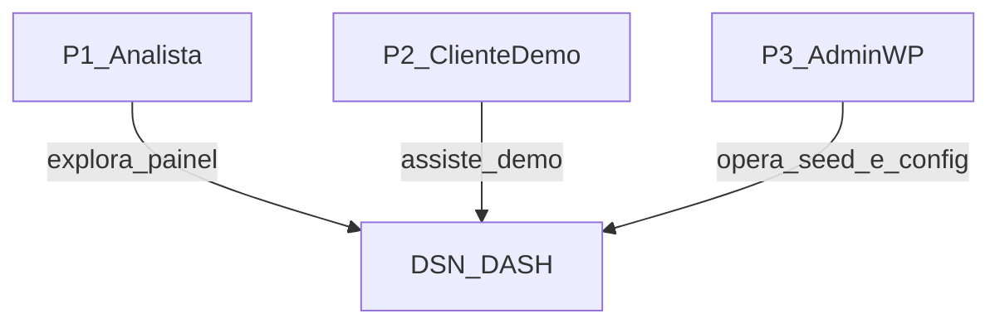

# DSN-DASH — C4 Context (nível 1)

| Campo | Valor |
|-------|-------|
| Projeto | DSN-DASH |
| Fase MEGA | Arquitetura |
| Origem | [US backlog](../02-user-stories/backlog.md), [RNF](../01-requirements/requisitos-nao-funcionais.md) |
| Destino | MOD-*, API-* |
| Data | 2026-09-20 |

---

## Propósito

Descrever o sistema DSN-DASH no contexto das pessoas que o usam e dos sistemas com os quais interage. Em ambiente de demo/local, **Elasticsearch, Kibana e Shiny fazem parte do sistema** (não são sistemas externos de terceiros).

---

## Pessoas

| ID | Pessoa | Interação |
|----|--------|-----------|
| P1 | Analista de desinformação | Explora páginas Por Tema / Por Plataforma, carrossel e gráficos (US-001..016) |
| P2 | Cliente / demonstração | Consome demo rápida; precisa de linguagem simples e dados fictícios explícitos (US-018, UC-09) |
| P3 | Admin WP | Prepara seed, verifica framing e que ES não está exposto (US-009, US-017, US-020) |

---

## Diagrama de contexto

**Fronteira do sistema DSN-DASH (demo):** WordPress + plugin `dsn-dashboard`, MySQL, Elasticsearch, Kibana, R/Shiny, seed fictício.

**Sistemas externos:** nenhum obrigatório na demo local. Produção futura pode integrar IdP/auth (RF-019 Won't — fora do incremento).

---

## Casos de uso de contexto (rastreio)

| Pessoa | Necessidade | US / UC |
|--------|-------------|---------|
| P1 | Ver propagação por tema e plataforma | US-001..007, UC-01..05 |
| P2 | Demo compreensível sem ML | US-012, US-016, US-018, UC-09 |
| P3 | Seed e framing | US-009, US-017, US-020, UC-06..08 |

---

## Decisões de fronteira

- O **browser do usuário** fala apenas com o **WordPress** (HTTP). Visualizações Kibana/Shiny entram via **iframe** (ADR-001).
- O browser **não** chama Elasticsearch (RNF-009).
- Ambiente empacotado em **Docker Compose** (ADR-002).

Ver containers: [c4-container.md](./c4-container.md).
