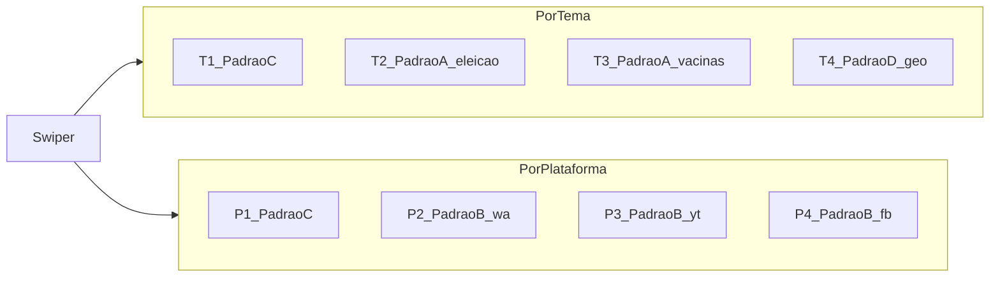

# DSN-DASH — Design do carrossel v2 (mosaico)

| Campo | Valor |
|-------|-------|
| Versão | 2.0 (mosaico) |
| Predecessor | [design-carrossel.md](./design-carrossel.md) (v1 — 1 gráfico/slide) |
| Padrões | [mosaico-padroes.md](./mosaico-padroes.md) |
| Swiper | ADR-003 (inalterado) |
| Homogeneidade | ADR-004 + tokens `--dsn-*` |
| Origem | RF-001, RF-002, RF-003, RNF-001, RNF-003, RNF-005 |
| Destino | TASK-008b, TASK-009b, TASK-010b |
| Data | 2026-09-20 |
| Status | **Implementado** (TASK-008b / 009b / 010b; RNF-003 consolidado) |

---

## Objetivos de layout (v2)

- Manter **4 slides × 2 páginas**; densificar cada slide (não aumentar quantidade).
- Cada slide = **mosaico** (≥3 KPIs + ≥1 barra + ≥1 linha temporal mensal).
- Desktop ≥1280px: mosaico em `100vh − header`, **sem scroll de página**.
- Mobile: grid 1 coluna; scroll **apenas dentro do slide**.
- Transição Swiper &lt; 300 ms (RNF-001); 1º conteúdo útil &lt; 5 s (RNF-003).

---

## Mapa geral

| Página | Slide | ID | Padrão | Fatia | Pergunta analítica |
|--------|-------|----|--------|-------|--------------------|
| Tema | 1 | T1 | C | global | Como volume e engajamento se distribuem entre temas e plataformas (2021–2024)? |
| Tema | 2 | T2 | A | `theme=eleicao` | Como a desinformação sobre eleição evolui no tempo e onde se concentra (plataforma/UF)? |
| Tema | 3 | T3 | A | `theme=vacinas` | Como a desinformação sobre vacinas evolui no tempo e onde se concentra (plataforma/UF)? |
| Tema | 4 | T4 | D | lente UF/região | Quais UFs e macrorregiões concentram eventos e como evoluem? |
| Plataforma | 1 | P1 | C | global (ângulo plat.) | Qual o share e a evolução do volume total por plataforma? |
| Plataforma | 2 | P2 | B | `platform=whatsapp` | O que circula no WhatsApp: tendência, temas × ano e top temas? |
| Plataforma | 3 | P3 | B | `platform=youtube` | O que circula no YouTube: tendência, temas × ano e top temas? |
| Plataforma | 4 | P4 | B | `platform=facebook` | O que circula no Facebook: tendência, temas × ano e top temas? |

*Instagram permanece visível em T1/P1 (visão cruzada); não ganha slide B dedicado nesta versão.*



---

## Convenções de KPI

| Campo | Regra |
|-------|-------|
| Período base | Ano calendário **2024** (seed) |
| Δ% | **(2024 − 2023) / 2023 × 100**; seta ↑ (accent/up) ou ↓ (down) |
| Rótulo de período | Sempre exibir “vs 2023” |
| Formatação | Inteiros com separador de milhar; % com 1 casa decimal |

---

## Página Por Tema

### T1 — Visão cruzada temas × plataformas (Padrão C)

| Campo | Valor |
|-------|-------|
| Título | Plataformas × Temas · 2021–2024 |
| Fatia | global |
| Pergunta | Como volume e engajamento se distribuem entre temas e plataformas (2021–2024)? |

**KPIs**

| # | Rótulo | Valor (conceito) | Δ% |
|---|--------|------------------|-----|
| 1 | Eventos 2024 | count(year=2024) | vs 2023 |
| 2 | Engajamento Σ 2024 | sum(engagement_count) 2024 | vs 2023 |
| 3 | Temas com volume | distinct theme com eventos 2024 | — ou Δ cobertura |
| 4 | Plataforma líder (share) | max share plataforma 2024 | pts vs 2023 |

**Gráficos:** barras empilhadas Tema×Plataforma; linha total mensal; donut share por plataforma.

```
┌──────────────────────────────────────────────┐
│  Plataformas × Temas · 2021–2024             │
├─────────┬─────────┬─────────┬────────────────┤
│ KPI 1   │ KPI 2   │ KPI 3   │  KPI 4         │
├──────────────────────────────────────────────┤
│  BARRAS EMPILHADAS: Tema × Plataforma        │
├──────────────────────┬───────────────────────┤
│ LINHA: Evolução total│ DONUT: Share por plat.│
└──────────────────────┴───────────────────────┘
```

---

### T2 — Eleição (Padrão A)

| Campo | Valor |
|-------|-------|
| Título | Eleição · 2021–2024 |
| Fatia | `theme=eleicao` |
| Pergunta | Como a desinformação sobre eleição evolui no tempo e onde se concentra (plataforma/UF)? |

**KPIs**

| # | Rótulo | Conceito | Δ% |
|---|--------|----------|-----|
| 1 | Eventos eleição 2024 | count theme=eleicao, year=2024 | vs 2023 |
| 2 | Engajamento Σ | sum engagement no tema | vs 2023 |
| 3 | Share no total | % eventos do tema / total 2024 | pts |
| 4 | Plataforma líder no tema | argmax plataforma | — |

**Gráficos:** linha mensal (tema); barras por plataforma; barras top 10 UF.

```
┌──────────────────────────────────────────────┐
│  Eleição · 2021–2024                         │
├─────────┬─────────┬─────────┬────────────────┤
│ KPI 1   │ KPI 2   │ KPI 3   │  KPI 4         │
├─────────┴─────────┴─────────┴────────────────┤
│   LINHA TEMPORAL (mensal, theme=eleicao)     │
├──────────────────────┬───────────────────────┤
│ BARRAS por PLATAFORMA│ BARRAS Top 10 UF      │
└──────────────────────┴───────────────────────┘
```

---

### T3 — Vacinas (Padrão A)

| Campo | Valor |
|-------|-------|
| Título | Vacinas · 2021–2024 |
| Fatia | `theme=vacinas` |
| Pergunta | Como a desinformação sobre vacinas evolui no tempo e onde se concentra (plataforma/UF)? |

**KPIs:** mesmos papéis de T2, filtrados a `theme=vacinas`.

**Gráficos:** idênticos ao Padrão A (linha + barras plataforma + top UF).

```
┌──────────────────────────────────────────────┐
│  Vacinas · 2021–2024                         │
├─────────┬─────────┬─────────┬────────────────┤
│ KPI 1   │ KPI 2   │ KPI 3   │  KPI 4         │
├─────────┴─────────┴─────────┴────────────────┤
│   LINHA TEMPORAL (mensal, theme=vacinas)     │
├──────────────────────┬───────────────────────┤
│ BARRAS por PLATAFORMA│ BARRAS Top 10 UF      │
└──────────────────────┴───────────────────────┘
```

---

### T4 — Distribuição geográfica (Padrão D)

| Campo | Valor |
|-------|-------|
| Título | Distribuição geográfica · 2021–2024 |
| Fatia | lente UF / macrorregião |
| Pergunta | Quais UFs e macrorregiões concentram eventos e como evoluem? |

**KPIs**

| # | Rótulo | Conceito | Δ% |
|---|--------|----------|-----|
| 1 | Eventos 2024 | total nacional | vs 2023 |
| 2 | UF líder | UF com mais eventos 2024 | — |
| 3 | Δ% UF líder | eventos UF líder | vs 2023 |
| 4 | Concentração top-5 | % eventos nas 5 UFs | pts |

**Gráficos:** mapa/choropleth UF (fallback: barras por macrorregião); top 10 UF; linha mensal por região N/NE/CO/SE/S.

```
┌──────────────────────────────────────────────┐
│  Distribuição geográfica · 2021–2024         │
├─────────┬─────────┬─────────┬────────────────┤
│ KPI 1   │ KPI 2   │ KPI 3   │  KPI 4         │
├──────────────────────┬───────────────────────┤
│  MAPA UF / regiões   │  BARRAS: Top 10 UFs   │
├──────────────────────┴───────────────────────┤
│  LINHA por macrorregião (N/NE/CO/SE/S)       │
└──────────────────────────────────────────────┘
```

---

## Página Por Plataforma

### P1 — Share e evolução por plataforma (Padrão C)

| Campo | Valor |
|-------|-------|
| Título | Volume por plataforma · 2021–2024 |
| Fatia | global (ângulo plataforma) |
| Pergunta | Qual o share e a evolução do volume total por plataforma? |

**KPIs**

| # | Rótulo | Conceito | Δ% |
|---|--------|----------|-----|
| 1 | Eventos 2024 | total | vs 2023 |
| 2 | Engajamento Σ 2024 | sum | vs 2023 |
| 3 | Plataforma líder | max count | share |
| 4 | Δ share líder | pts percentuais | vs 2023 |

**Gráficos:** barras empilhadas (ênfase plataforma × tema); linha total mensal; donut share por plataforma.

```
┌──────────────────────────────────────────────┐
│  Volume por plataforma · 2021–2024           │
├─────────┬─────────┬─────────┬────────────────┤
│ KPI 1   │ KPI 2   │ KPI 3   │  KPI 4         │
├──────────────────────────────────────────────┤
│  BARRAS EMPILHADAS: Plataforma × Tema        │
├──────────────────────┬───────────────────────┤
│ LINHA: Evolução total│ DONUT: Share por plat.│
└──────────────────────┴───────────────────────┘
```

---

### P2 — WhatsApp (Padrão B)

| Campo | Valor |
|-------|-------|
| Título | WhatsApp · 2021–2024 |
| Fatia | `platform=whatsapp` |
| Pergunta | O que circula no WhatsApp: tendência, temas × ano e top temas? |

**KPIs**

| # | Rótulo | Conceito | Δ% |
|---|--------|----------|-----|
| 1 | Eventos WA 2024 | count | vs 2023 |
| 2 | Engajamento Σ | sum | vs 2023 |
| 3 | Share no total | % da plataforma | pts |
| 4 | Tema líder | argmax theme | — |

**Gráficos:** linha mensal; heatmap Tema×Ano; barras top 10 temas.

```
┌──────────────────────────────────────────────┐
│  WhatsApp · 2021–2024                        │
├─────────┬─────────┬─────────┬────────────────┤
│ KPI 1   │ KPI 2   │ KPI 3   │  KPI 4         │
├─────────────────────────────┬────────────────┤
│  LINHA TEMPORAL (mensal)    │ HEATMAP        │
│                             │ Tema × Ano     │
├─────────────────────────────┴────────────────┤
│  BARRAS: Top 10 temas nesta plataforma       │
└──────────────────────────────────────────────┘
```

---

### P3 — YouTube (Padrão B)

| Campo | Valor |
|-------|-------|
| Título | YouTube · 2021–2024 |
| Fatia | `platform=youtube` |
| Pergunta | O que circula no YouTube: tendência, temas × ano e top temas? |

Mesma estrutura de P2 com fatia `youtube` (canal de alto engajamento no seed).

---

### P4 — Facebook (Padrão B)

| Campo | Valor |
|-------|-------|
| Título | Facebook · 2021–2024 |
| Fatia | `platform=facebook` |
| Pergunta | O que circula no Facebook: tendência, temas × ano e top temas? |

Mesma estrutura de P2 com fatia `facebook`.

---

## Viewport e responsividade

```
Desktop (≥1280px)
+------------------------------------------------------------------+
| header DSN (nav + badge)                         ~56–72px        |
+------------------------------------------------------------------+
| título slide + indicador n/4                     ~32px           |
+------------------------------------------------------------------+
| .dsn-mosaic (CSS Grid 12)                                        |
|   altura = 100vh - header - título - controles                   |
|   overflow: hidden                                               |
+------------------------------------------------------------------+
| prev / next / dots                               ~40px           |
+------------------------------------------------------------------+

Mobile
- grid-template-columns: 1fr
- .dsn-slide { overflow-y: auto; max-height: calc(100vh - chrome) }
- página-host continua sem scroll como navegação principal (RF-003)
```

Risco residual: **BUG-001** (chrome do tema WP) pode consumir viewport; TASK-008b deve medir altura útil real e, se necessário, compactar KPIs.

---

## Estados (inalterados em espírito)

`loading | ready | error | empty` aplicam-se ao mosaico: skeleton nos slots; se a fatia não tiver dados, `empty` no slide inteiro; framing bloqueado → `error` nos painéis embed.

---

## Relação v1 → v2

| v1 (atual) | v2 |
|------------|-----|
| 1 iframe / slide | mosaico multi-slot |
| Slides genéricos Kibana/Shiny | Fatias temáticas/plataforma/geo |
| Caption curta | Pergunta analítica + título de fatia |

Arquivo v1 permanece como histórico; implementação futura referencia **apenas v2**.

---

## Critérios de aceite deste documento

- [x] Todo slide com pergunta + ≥3 KPIs + ≥1 barra + ≥1 linha
- [x] Padrões A–D referenciados
- [x] 100vh desktop / scroll-in-slide mobile descritos
- [x] Aprovação stakeholder (gate antes de TASK-008b) — implementado TASK-008b/009b

## Status implementação

| Slide | Padrão | Status |
|-------|--------|--------|
| T1 | C | Done |
| T2 | A eleicao | Done |
| T3 | A vacinas | Done |
| T4 | D geo | Done |
| P1 | C | Done |
| P2 | B WhatsApp | Done |
| P3 | B YouTube | Done |
| P4 | B Facebook | Done |

## Próximo passo

1. ~~TASK-008b / 009b / 010b~~  
2. ~~Opcional: consolidar embeds (1 dashboard multi-painel) para RNF-003~~ **Done**  
3. Tag / release notes da onda mosaico (pós-v0.1.0)
3. Tag patch / release notes pós-mosaico
