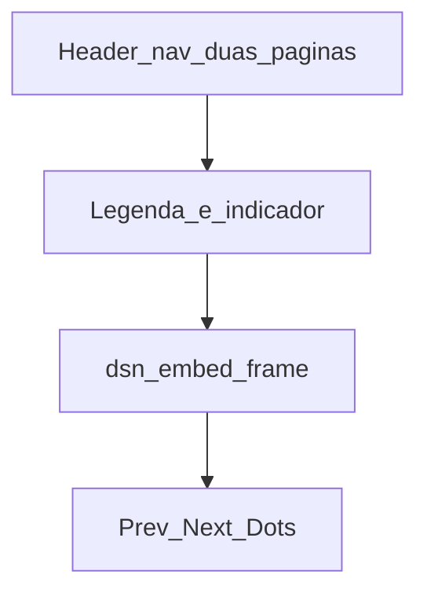
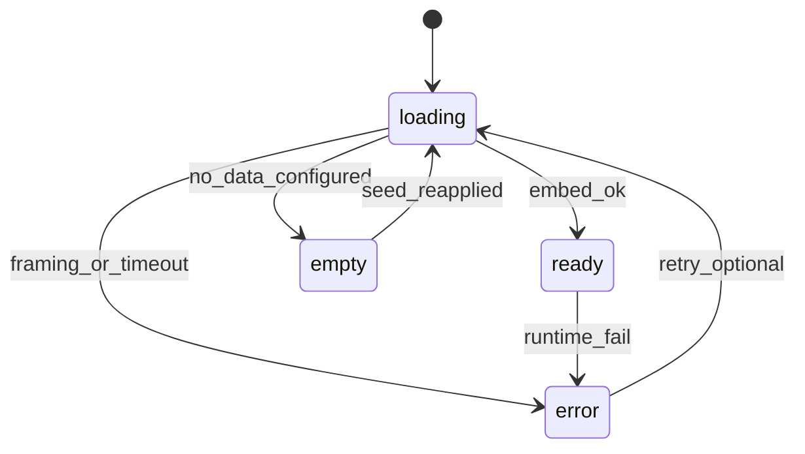

# DSN-DASH — Design do carrossel (wireframe)

| Campo | Valor |
|-------|-------|
| Módulo | MOD-CAROUSEL, MOD-WP-PLUGIN |
| Biblioteca | Swiper.js (ADR-003) |
| Homogeneização | Wrapper host (ADR-004) |
| Origem | RNF-001, RNF-002, RNF-005, RNF-006; US-003, US-014, US-020, US-021 |
| Data | 2026-09-20 |

---

## Objetivos de layout

- Viewport **~100vh**; página-host **sem scroll vertical** (RNF-002).
- **4 slides** por página (`tema` | `plataforma`).
- Transição host **&lt; 300 ms** (RNF-001).
- Teclado + foco visível (RNF-006).
- Wrapper unificado para iframes Kibana/Shiny.

---

## Wireframe (ASCII)

```
+------------------------------------------------------------------+
| [Por Tema]  [Por Plataforma]              [Dados fictícios]      |  header WP
+------------------------------------------------------------------+
| Legenda do slide (texto curto)                     2 / 4         |
+------------------------------------------------------------------+
|                                                                  |
|   +----------------------------------------------------------+   |
|   |  .dsn-embed-frame                                        |   |
|   |                                                          |   |
|   |     [ iframe Kibana | Shiny  OR  placeholder estado ]    |   |
|   |                                                          |   |
|   +----------------------------------------------------------+   |
|                                                                  |
|              ( < )                         ( > )                 |
|                    o  o  *  o                                    |
+------------------------------------------------------------------+
|                          100vh, overflow:hidden                  |
+------------------------------------------------------------------+
```



---

## Tokens CSS (mínimo ≥4 cores — RNF-005 / RNF-008)

| Token | Papel |
|-------|--------|
| `--dsn-color-bg` | Fundo do shell |
| `--dsn-color-surface` | Fundo do `.dsn-embed-frame` |
| `--dsn-color-accent` | Controles ativos / nav |
| `--dsn-color-text` | Texto corpo (contraste ≥ 4.5:1) |
| `--dsn-font-family` | Família tipográfica do shell |
| `--dsn-embed-pad` | Padding externo do frame (alinhar ±8 px entre origens) |

Shiny e parâmetros de embed Kibana devem espelhar esses tokens **na origem do filho**, não por injection (ADR-004).

---

## Estados por slide (`data-state`)

| Estado | Quando | UI |
|--------|--------|-----|
| `loading` | iframe ainda carregando / timeout não atingido | Skeleton ou spinner no `.dsn-embed-frame`; `title` do iframe já presente se o nó existir |
| `ready` | conteúdo do embed visível | iframe visível; sem mensagem de erro |
| `error` | framing bloqueado ou falha de carga (US-020 / UC-06) | Mensagem: “Visualização temporariamente indisponível”; sem link para ES |
| `empty` | dado/visualização ausente (US-021 / UC-07) | Mensagem: “Dado indisponível neste slide”; carrossel permanece navegável |

### Transições de estado



---

## Comportamento Swiper (contrato)

- `slidesPerView: 1`, direção horizontal
- Velocidade de transição configurada para cumprir mediana &lt; 300 ms
- `keyboard: enabled`
- Navegação prev/next + paginação (indicador “n de 4”)
- `watchOverflow` / altura fixa da área do frame para não expandir o host

---

## Mapeamento slide → embed (exemplo de conteúdo)

Definido na implementação do shortcode; exemplo para `page="tema"`:

| Slide | `data-embed-type` | Conteúdo típico |
|-------|-------------------|-----------------|
| 1 | kibana | Volume por tema/ano |
| 2 | kibana | Temas × engajamento |
| 3 | shiny | Comparativo descritivo ggplot |
| 4 | shiny ou kibana | Recorte UF / série simples |

`page="plataforma"`: mesma regra — **≥1 kibana e ≥1 shiny** (RF-006/007).

---

## Acessibilidade

- Todo `iframe` com `title` não vazio (RNF-007)
- Controles com foco visível
- Mensagens `error`/`empty` em texto (não só cor)

## Próximo passo

Implementar markup do shortcode + assets Swiper no MOD-WP-PLUGIN conforme [c4-container.md](./c4-container.md).
