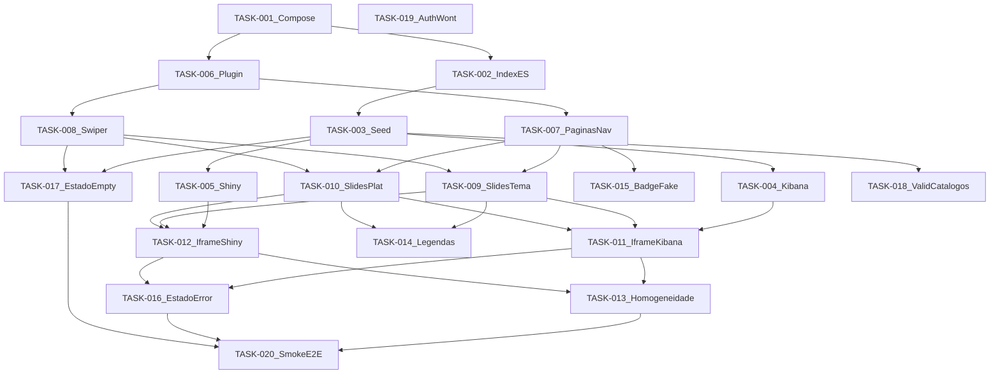

# DSN-DASH — Grafo de dependências (TASK)

| Campo | Valor |
|-------|-------|
| Projeto | DSN-DASH |
| Fase MEGA | Planejamento |
| Relacionado | [backlog-tecnico.md](./backlog-tecnico.md) |
| Data | 2026-09-20 |

---

## Diagrama DAG



TASK-019 é **isolada** (sem arestas de dependência de implementação).

---

## Aciclicidade

O grafo é um **DAG**: todas as arestas apontam de IDs menores de fundação para IDs de integração, sem retorno.

### Ordem topológica válida

```
TASK-001
TASK-002, TASK-006          (após 001; paralelos)
TASK-003, TASK-007, TASK-008 (003 após 002; 007/008 após 006)
TASK-018, TASK-004, TASK-005, TASK-009, TASK-010, TASK-015, TASK-017
TASK-014                    (após 009, 010)
TASK-011, TASK-012          (após 004+009+010 / 005+009+010)
TASK-013, TASK-016          (após 011+012)
TASK-020                    (após 013, 016, 017)
TASK-019                    (qualquer momento; Won't)
```

Nenhuma TASK aparece antes de suas dependências nesta ordem ⇒ **sem ciclos**.

---

## Caminho crítico

Cadeia mais longa em bloqueio de valor (dados → framing Kibana → wire → polish → smoke):

```
TASK-001 → TASK-002 → TASK-003 → TASK-004 → TASK-011 → TASK-013 → TASK-020
```

| Etapa | Por que crítica |
|-------|-----------------|
| 001 | Sem Compose, nada sobe |
| 002–003 | Sem índice/seed, Kibana/Shiny vazios |
| 004 | Framing Kibana = risco alto histórico |
| 011 | Integra iframe no host |
| 013 | Homogeneidade exige ambos embeds |
| 020 | Validação E2E do incremento |

### Paralelos úteis (fora do caminho crítico, mas no caminho)

| Paralelo | Com |
|----------|-----|
| TASK-006 ∥ TASK-002 | Ambos após 001 |
| TASK-005 ∥ TASK-004 | Ambos após 003 |
| TASK-012 ∥ TASK-011 | Wire Shiny ∥ Kibana |
| TASK-014, TASK-015, TASK-018 | Polish/validação em paralelo às ondas 4–5 |

Caminho alternativo quase tão longo (Shiny):  
`001 → 002 → 003 → 005 → 012 → 013 → 020` — tratar framing Shiny com mesma prioridade operacional que Kibana.

---

## Riscos no caminho crítico

1. **Framing Kibana/proxy** (TASK-004 / 011) — XFO / `frame_ancestors`
2. **Seed dimensional completo** (TASK-003) — volume e reprodutibilidade
3. **Homogeneidade Kibana vs Shiny** (TASK-013) — chrome Kibana
4. **RAM Docker** (TASK-001 / 020) — ES+Kibana+WP+Shiny

---

## Critérios de conclusão

- [x] Grafo sem ciclos
- [x] Ordem topológica documentada
- [x] Caminho crítico identificado

## Próximo passo

Iniciar implementação pela cabeça do caminho crítico: **TASK-001**.
